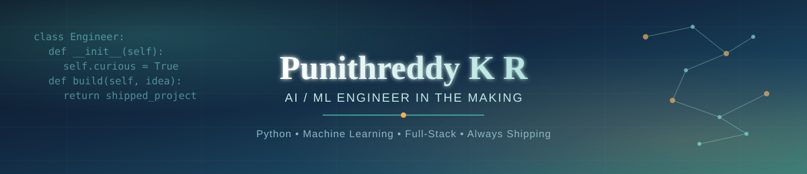

 

## 👋 About Me

Computer Science & Engineering student at **Sri Krishna Institute of Technology, Bengaluru** (CGPA 8.1, 2023–2027), building hands-on experience across **software development, AI/ML, and data analysis**. I like taking projects from idea to working system — from computer-vision authentication to full ML pipelines — and I'm currently looking for an **internship** to put these skills to work on real problems.

- 🧠 Focused on: Python, Machine Learning, Data Analysis, Full-Stack Web Development
- 🏗️ Recently shipped: a breast cancer diagnostic classifier (98.2% accuracy) and a face-recognition voting system
- 🏆 Core team member & organizer, **Build for Bengaluru Hackathon 2026**
- 📜 Certified: **Microsoft Azure AI Fundamentals (AI-900)**, 2025
- 🌍 Based in Bengaluru, Karnataka, India

 

## 🛠️ Tech Stack

**Languages**

**Web**

**ML / Data**

**Tools & Platforms**

 

## 📊 GitHub Stats

 

## 📌 Featured Projects

<table>
<tr>
<td width="50%">

**🗳️ Online Voting System — Face Recognition**
`Python` `Node.js` `HTML/CSS`

Secure voting platform using facial recognition for user authentication, preventing duplicate or unauthorized votes. Python-based face detection backend paired with a Node.js server and a responsive frontend.

</td>
<td width="50%">

**🎗️ Breast Cancer Detection**
`Python` `scikit-learn` `Pandas`

ML pipeline comparing 4 classifiers (Logistic Regression, Random Forest, SVM, KNN) on the Wisconsin Diagnostic dataset — **98.2% accuracy**, **0.995 ROC-AUC**. [→ View repo](https://github.com/punithreddy-ai/Breast_Cancer_Detection)

</td>
</tr>
<tr>
<td width="50%">

**📚 Library Management System**
`Python` `MySQL`

Book record management system with registration, login, search, issue/return, and fine calculation, using Python's CSV, datetime, and OS modules for data handling.

</td>
<td width="50%">

**🏁 More on the way**
`Always building`

Currently exploring MLOps and deployment — expect more end-to-end projects here soon.

</td>
</tr>
</table>

 

## 💼 Experience

**Tech Team Member & Organizer** — Build for Bengaluru Hackathon 2026 · Bengaluru
- Core tech team member for a 24-hour hackathon, contributing to end-to-end planning, coordination, and technical execution
- Coordinated on-ground technical infrastructure for smooth event delivery
- Practiced cross-functional collaboration, leadership, and time management under pressure

 

## 🎓 Education

| Institution | Program | Score | Years |
|---|---|---|---|
| Sri Krishna Institute of Technology, Bengaluru | B.E., Computer Science Engineering | CGPA 8.1 | 2023 – 2027 |
| Amara Jyothi PU College, Karnataka | II PUC (PCMCS) | 81% | 2021 – 2023 |

 

## ⚡ Beyond Code

🏎️ Formula 1 & race engineering strategy &nbsp;|&nbsp; 🏃 Running &nbsp;|&nbsp; 🤝 Team sports &nbsp;|&nbsp; 📡 Tracking emerging tech

 

📄 Full details in my <a href="https://github.com/punithreddy-ai/punithreddy-ai/blob/main/Punithreddy_KR_Resume.pdf">resume</a> · 📫 Reach me at punithreddykr33@gmail.com · 🚧 Actively building — check back often

